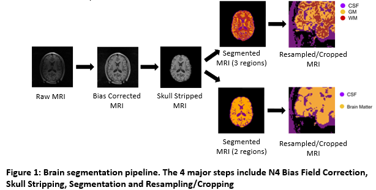
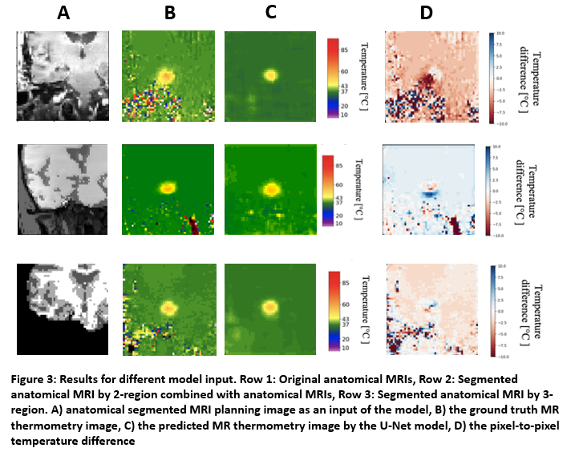

# 3D U-Net for MRI to MRI Thermometry Prediction

A deep learning pipeline for predicting MRI thermometry images from standard MRI scans using a 3D U-Net architecture with integrated segmentation capabilities.

## Overview

This project implements a 3D U-Net model that performs image-to-image translation from diagnostic MRI scans to MRI thermometry images. The architecture is enhanced with segmentation integration to improve prediction accuracy in regions of interest.

## Key Features

- **3D U-Net Architecture**: Deep convolutional neural network optimized for volumetric medical image prediction
- **Integrated Segmentation Pipeline**: Automated segmentation workflow to improve thermometry predictions in target regions
- **Advanced Data Augmentation**: Comprehensive augmentation strategies tailored for medical imaging
- **Hyperparameter Optimization**: Extensively tuned model parameters for optimal performance
- **End-to-End Pipeline**: Complete workflow from data preprocessing to model inference

## Pipeline Architecture



## Technical Details

### Model Architecture
- **Base Model**: 3D U-Net with encoder-decoder structure
- **Input**: 3D MRI volumes (T1/T2-weighted sequences)
- **Output**: 3D MRI thermometry maps
- **Segmentation Integration**: Mask-guided feature extraction for improved spatial localization

### Data Augmentation
The pipeline includes multiple augmentation techniques optimized for medical imaging:
- Random 3D rotations and flips
- Elastic deformations
- Intensity transformations (gamma correction, contrast adjustment)
- Gaussian noise injection
- Spatial dropout

### Hyperparameter Optimization
Key optimized parameters:
- Learning rate scheduling
- Batch size and normalization strategies
- Loss function weights
- Network depth and feature map dimensions
- Dropout rates and regularization

## Requirements

- Python 3.8+
- PyTorch 1.10+
- CUDA 11.0+ (for GPU acceleration)
- Jupyter Notebook
- Additional dependencies for medical imaging (nibabel, pydicom, SimpleITK, etc.)

## Usage

### 1. Segmentation

**File:** `segmentation_all.ipynb`

- The root directory must contain all "LP-xxxx" files including `anatomicalProbesEye` and `temperatureData`
- **IMPORTANT:** `extractor.py` in this repo MUST REPLACE the imported version (copy/paste to override)
- References and explanations are included in the code at the end of each major function
- To redo segmentation: save segmentation DICOM in the same location with the same naming convention

### 2. Resampling and Cropping

**File:** `resample_crop.ipynb`

- Requires MTLE files as root directory
- Remove final `break` in bottom cell to run with all patients
- References and explanations included at the end of each major function
- To use different laser location: replace "projected laser" in main function

### 3. Utilities

**File:** `utils.ipynb`

- Removes T2-weighted MRIs (and other specified images) using `bad_list` variable
- Combines segmentation and anatomical MRI ProbesEye PNGs for training

### 4. Visualization

**File:** `Final_visualization.ipynb`

- Visualizes ProbesEye PNG with specific laser location
- Provides 3D slider for DICOM images (converts to NIfTI for visualization)

### Training Hyperparameters

- **Learning Rate:** 0.0022
- **Batch Size:** 16
- **Epochs:** 800

## Project Structure

```
├── segmentation_all.ipynb          # Main segmentation pipeline
├── resample_crop.ipynb             # Resampling and cropping operations
├── utils.ipynb                     # Utility functions for data preparation
├── Final_visualization.ipynb       # Visualization tools
├── extractor.py                    # Custom extractor 
├── LP-xxxx/                        # Patient data directories
│   ├── anatomicalProbesEye/       # Anatomical MRI data
│   └── temperatureData/           # Thermometry data
├── MTLE/                          # Resampled data directory
└── outputs/                       # Model predictions and results
```

## Key Contributions

### Segmentation Integration
- Developed automated segmentation workflow to identify target anatomical regions
- Integrated segmentation masks into the prediction pipeline for improved accuracy
- Implemented mask-guided loss functions to focus training on relevant areas

### Data Augmentation
- Designed and implemented medical imaging-specific augmentation strategies
- Balanced augmentation intensity to prevent overfitting while maintaining anatomical realism
- Created augmentation pipelines that preserve thermometry-relevant features

### Hyperparameter Tuning
- Systematic exploration of network architecture parameters
- Optimization of training strategies including learning rates, batch sizes, and regularization
- Cross-validation framework for robust parameter selection

## Results

### Performance Metrics

The table below shows the results of training sessions with different segmentation configurations:

| Training Session | SSIM | RMSE °C | Max-Difference °C |
|-----------------|------|---------|-------------------|
| Baseline (Original) | 0.82 | 5.99 | 15.12 |
| 2-region mix | 0.82 | 3.75 | 6.29 |
| 2-region segmentation | 0.83 | 4.83 | 12.75 |
| 3-region mix | 0.83 | 3.61 | 8.47 |
| **3-region segmentation** | **0.86** | **3.03** | **6.84** |

**Key Findings:**
- The 3-region segmentation approach achieved the best overall performance with SSIM of 0.86
- RMSE improved by 49.4% (from 5.99°C to 3.03°C) compared to baseline
- Maximum temperature difference reduced by 54.8% (from 15.12°C to 6.84°C)
- Segmentation integration consistently improved prediction accuracy across all metrics

### Qualitative Results



**Figure 3**: Results for different model inputs showing (Row 1) Original anatomical MRIs, (Row 2) Segmented anatomical MRI by 2-region combined with anatomical MRIs, (Row 3) Segmented anatomical MRI by 3-region. Columns show: A) anatomical segmented MRI planning image as input, B) ground truth MR thermometry image, C) predicted MR thermometry image by the U-Net model, D) pixel-to-pixel temperature difference.


